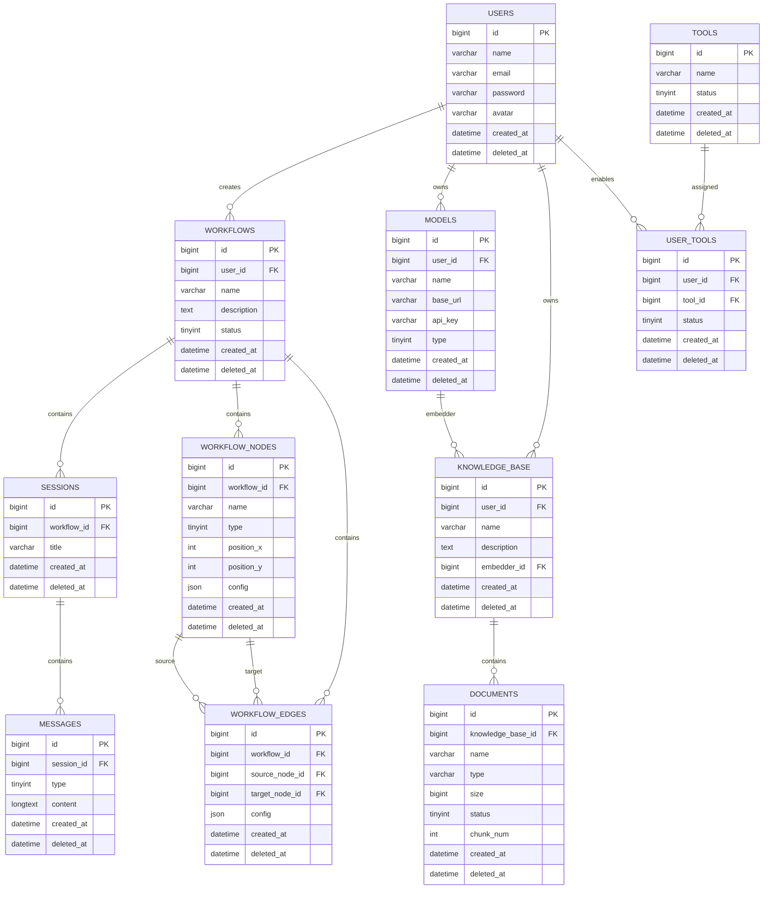

# users

|   字段名   |   数据类型   |        描述        |
| :--------: | :----------: | :----------------: |
|     id     |    bigint    |    主键，雪花ID    |
|    name    | varchar(50)  |      用户昵称      |
|   email    | varchar(100) |    邮箱（唯一）    |
|  password  | varchar(255) |   bcrypt后的密码   |
|   avatar   | varchar(255) |      头像URL       |
| created_at | datetime(3)  |      创建时间      |
| deleted_at | datetime(3)  | 删除时间（软删除） |

```mysql
CREATE TABLE users (
    id BIGINT PRIMARY KEY,
    name VARCHAR(50) NOT NULL,
    email VARCHAR(100) NOT NULL UNIQUE,
    password VARCHAR(255) NOT NULL,
    avatar VARCHAR(255),
    created_at DATETIME(3) NOT NULL DEFAULT CURRENT_TIMESTAMP(3),
    deleted_at DATETIME(3) DEFAULT NULL
);
```

------

# workflows

|   字段名    |   数据类型   |    描述     |
| :---------: | :----------: | :---------: |
|     id      |    bigint    |  工作流ID   |
|   user_id   |    bigint    |   创建者    |
| description |     text     |    描述     |
|    name     | varchar(100) | 工作流名称  |
|   status    |   tinyint    | 0禁用 1启用 |
| created_at  | datetime(3)  |  创建时间   |
| deleted_at  | datetime(3)  |  删除时间   |

```mysql
CREATE TABLE workflows (
    id BIGINT PRIMARY KEY,
    user_id BIGINT NOT NULL,
    description TEXT,
    name VARCHAR(100) NOT NULL,
    status TINYINT NOT NULL DEFAULT 1,
    created_at DATETIME(3) NOT NULL DEFAULT CURRENT_TIMESTAMP(3),
    deleted_at DATETIME(3),
    INDEX idx_user(user_id)
);
```

------

# sessions

|   字段名    |   数据类型   |    描述    |
| :---------: | :----------: | :--------: |
|     id      |    bigint    |   会话ID   |
| workflow_id |    bigint    | 所属工作流 |
|    title    | varchar(100) |  会话标题  |
| created_at  | datetime(3)  |  创建时间  |
| deleted_at  | datetime(3)  |  删除时间  |

```mysql
CREATE TABLE sessions (
    id BIGINT PRIMARY KEY,
    workflow_id BIGINT NOT NULL,
    title VARCHAR(100),
    created_at DATETIME(3) DEFAULT CURRENT_TIMESTAMP(3),
    deleted_at DATETIME(3),
    INDEX idx_workflow(workflow_id)
);
```

------

# messages

|   字段名   |  数据类型   |          描述           |
| :--------: | :---------: | :---------------------: |
|     id     |   bigint    |         消息ID          |
| session_id |   bigint    |        所属会话         |
|    type    |   tinyint   | 0用户 1AI 2System 3Tool |
|  content   |  longtext   |        消息内容         |
| created_at | datetime(3) |        创建时间         |
| deleted_at | datetime(3) |        删除时间         |

```mysql
CREATE TABLE messages (
    id BIGINT PRIMARY KEY,
    session_id BIGINT NOT NULL,
    type TINYINT NOT NULL,
    content LONGTEXT NOT NULL,
    created_at DATETIME(3) DEFAULT CURRENT_TIMESTAMP(3),
    deleted_at DATETIME(3),
    INDEX idx_session(session_id)
);
```

------

# tools
| 字段             | 含义                        |
| ---------------- | --------------------------- |
| `id`             | AgentHub 自己的 Tool ID     |
| `name`           | AgentHub 展示名称           |
| `description`    | AgentHub 展示描述           |
| `avatar`         | 工具头像                    |
| `type`           | 工具类型                    |
| `mcp_server_url` | MCP Server 地址             |
| `mcp_tool_name`  | MCP Server 中真实 Tool 名称 |
| `status`         | AgentHub 是否启用           |
| `created_at`     | 创建时间                    |
| `updated_at`     | 更新时间                    |

```mysql
CREATE TABLE tools (
    id BIGINT NOT NULL,

    name VARCHAR(100) NOT NULL,
    description TEXT,
    avatar VARCHAR(255),

    type TINYINT NOT NULL DEFAULT 1,

    mcp_server_url VARCHAR(500),
    mcp_tool_name VARCHAR(100),

    status TINYINT NOT NULL DEFAULT 1,

    created_at DATETIME(3) NOT NULL,
    updated_at DATETIME(3) NOT NULL,

    PRIMARY KEY (id),

    UNIQUE KEY uk_mcp_tool (
        mcp_server_url,
        mcp_tool_name
    ),

    KEY idx_status (status)
) ENGINE=InnoDB
  DEFAULT CHARSET=utf8mb4
  COLLATE=utf8mb4_unicode_ci;
```

------

# models

|   字段名   |   数据类型   |        描述        |
| :--------: | :----------: | :----------------: |
|     id     |    bigint    |       模型ID       |
|  user_id   |    bigint    |      所属用户      |
|    name    | varchar(100) |        名称        |
|  base_url  | varchar(255) | OpenAI兼容BaseURL  |
|  api_key   | varchar(255) |      API Key       |
|    type    |   tinyint    | 0 Chat 1 Embedding |
| created_at | datetime(3)  |      创建时间      |
| deleted_at | datetime(3)  |      删除时间      |

```mysql
CREATE TABLE models (
    id BIGINT PRIMARY KEY,
    user_id BIGINT NOT NULL,
    name VARCHAR(100) NOT NULL,
    provider TINYINT NOT NULL,
    base_url VARCHAR(255),
    api_key VARCHAR(255) NOT NULL,
    type TINYINT NOT NULL,
    created_at DATETIME(3) DEFAULT CURRENT_TIMESTAMP(3),
    deleted_at DATETIME(3),
    INDEX idx_user(user_id)
);
```

------

# workflow_nodes

|   字段名    |   数据类型   |   描述   |
| :---------: | :----------: | :------: |
|     id      |    bigint    |  节点ID  |
| workflow_id |    bigint    | 工作流ID |
|    name     | varchar(100) | 节点名称 |
|    type     |   tinyint    | 节点类型 |
| position_x  |     int      |  X坐标   |
| position_y  |     int      |  Y坐标   |
|   config    |     json     | 节点配置 |
| created_at  | datetime(3)  | 创建时间 |
| deleted_at  | datetime(3)  | 删除时间 |

```mysql
CREATE TABLE workflow_nodes (
    id BIGINT PRIMARY KEY,
    workflow_id BIGINT NOT NULL,
    name VARCHAR(100) NOT NULL,
    type TINYINT NOT NULL,
    position_x INT NOT NULL,
    position_y INT NOT NULL,
    config JSON NOT NULL,
    created_at DATETIME(3) DEFAULT CURRENT_TIMESTAMP(3),
    deleted_at DATETIME(3),
    INDEX idx_workflow(workflow_id)
);
```

------

# workflow_edges


|     字段名     |  数据类型   |   描述   |
| :------------: | :---------: | :------: |
|       id       |   bigint    |   边ID   |
|  workflow_id   |   bigint    | 工作流ID |
| source_node_id |   bigint    | 起始节点 |
| target_node_id |   bigint    | 目标节点 |
|     config     |    json     |  边配置  |
|   created_at   | datetime(3) | 创建时间 |
|   deleted_at   | datetime(3) | 删除时间 |

```mysql
CREATE TABLE workflow_edges (
    id BIGINT PRIMARY KEY,
    workflow_id BIGINT NOT NULL,
    source_node_id BIGINT NOT NULL,
    target_node_id BIGINT NOT NULL,
    config JSON,
    created_at DATETIME(3) DEFAULT CURRENT_TIMESTAMP(3),
    deleted_at DATETIME(3),
    INDEX idx_workflow(workflow_id),
    INDEX idx_source(source_node_id),
    INDEX idx_target(target_node_id)
);
```

------

# knowledge_base

|   字段名    |   数据类型   |      描述       |
| :---------: | :----------: | :-------------: |
|     id      |    bigint    |    知识库ID     |
|   user_id   |    bigint    |    所属用户     |
| description |     text     |      描述       |
|    name     | varchar(100) |      名称       |
| embedder_id |    bigint    | Embedding模型ID |
| created_at  | datetime(3)  |    创建时间     |
| deleted_at  | datetime(3)  |    删除时间     |

```mysql
CREATE TABLE knowledge_base (
    id BIGINT PRIMARY KEY,
    user_id BIGINT NOT NULL,
    description TEXT,
    name VARCHAR(100) NOT NULL,
    embedder_id BIGINT NOT NULL,
    created_at DATETIME(3) DEFAULT CURRENT_TIMESTAMP(3),
    deleted_at DATETIME(3),
    INDEX idx_user(user_id),
    INDEX idx_embedder(embedder_id)
);
```

------

# documents

|      字段名       |   数据类型   |      描述      |
| :---------------: | :----------: | :------------: |
|        id         |    bigint    |     文档ID     |
| knowledge_base_id |    bigint    |   所属知识库   |
|       name        | varchar(255) |     文件名     |
|       type        | varchar(20)  | pdf/docx/md... |
|       size        |    bigint    | 文件大小(Byte) |
|      status       |   tinyint    |    解析状态    |
|     chunk_num     |     int      |   Chunk数量    |
|    created_at     | datetime(3)  |    创建时间    |
|    deleted_at     | datetime(3)  |    删除时间    |

```mysql
CREATE TABLE documents (
    id BIGINT PRIMARY KEY,
    knowledge_base_id BIGINT NOT NULL,
    name VARCHAR(255) NOT NULL,
    type VARCHAR(20) NOT NULL,
    size BIGINT NOT NULL,
    status TINYINT NOT NULL DEFAULT 0,
    chunk_num INT DEFAULT 0,
    created_at DATETIME(3) DEFAULT CURRENT_TIMESTAMP(3),
    deleted_at DATETIME(3),
    INDEX idx_kb(knowledge_base_id)
);
```

------

# user_tools

|   字段名   |  数据类型   |   描述   |
| :--------: | :---------: | :------: |
|     id     |   bigint    |   主键   |
|  user_id   |   bigint    |   用户   |
|  tool_id   |   bigint    |   Tool   |
|   status   |   tinyint   | 是否启用 |
| created_at | datetime(3) | 创建时间 |
| deleted_at | datetime(3) | 删除时间 |

```mysql
CREATE TABLE user_tools (
    id BIGINT PRIMARY KEY,
    user_id BIGINT NOT NULL,
    tool_id BIGINT NOT NULL,
    status TINYINT NOT NULL DEFAULT 1,
    created_at DATETIME(3) DEFAULT CURRENT_TIMESTAMP(3),
    deleted_at DATETIME(3),
    UNIQUE KEY uk_user_tool(user_id, tool_id),
    INDEX idx_user(user_id),
    INDEX idx_tool(tool_id)
);
```

# E-R 图




